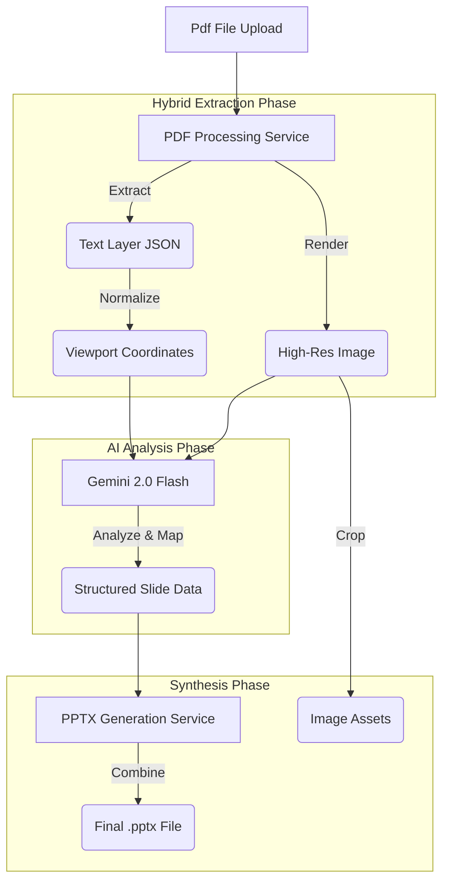

# 🏗️ System Architecture

## Overview

The application follows a linear pipeline architecture enhanced by a "Hybrid Parsing" loop. The goal is to convert a static PDF document into a structured, semantic object model that can be serialized into a PowerPoint file.

## Data Flow Pipeline

## Core Components

### 1. PDF Processing Service (`pdfService.ts`)
Responsibility: **Deconstruct the PDF**.
- **Visual Layer**: Renders the page to an HTML5 Canvas and exports a Base64 JPEG. This gives the AI the "visual context".
- **Text Layer**: Uses `page.getTextContent()` from PDF.js.
  - *Challenge*: PDF coordinates are "bottom-left" based and use points (1/72 inch).
  - *Solution*: A normalization pipeline converts these to a 0-100% relative viewport system to match the visual layer.

### 2. The Intelligence Layer (`geminiService.ts`)
Responsibility: **Semantic Understanding**.
- **Model**: `gemini-2.0-flash` (Chosen for speed and long-context capabilities).
- **Prompt Strategy**: "Ground Truth Anchor".
  - We do *not* ask the AI to OCR the text (which is prone to hallucinations).
  - We provide the `EXTRACTED_TEXT_LAYER` and ask the AI to: "Identify where this text is visually located, what groups it belongs to, and what the background/shape context is."

### 3. PPTX Synthesis Service (`pptxService.ts`)
Responsibility: **Reconstruction**.
- Uses `pptxgenjs` to create native PowerPoint objects.
- **Smart Cropping**: If the AI identifies a region as an "Image" (e.g., a photo or complex diagram), the service dynamically crops that region from the original Page Image and places it as a distinct picture element.
- **Vector Shapes**: Background boxes and dividers are drawn as native shapes, making them editable (color, size, border).
